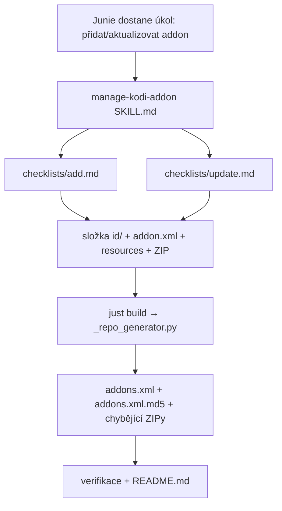

# Requirements

### Přehled a cíle

Vytvořit jeden Agent Skill (`manage-kodi-addon`), který zdokumentuje ověřený postup pro **přidání nového** i **aktualizaci existujícího** Kodi doplňku v tomto repository (CzechGod). Skill bude sloužit jako spolehlivá „tahák" příručka, aby budoucí úpravy repozitáře probíhaly konzistentně a bez chyb (správná struktura ZIPu, regenerace katalogu, aktualizace dokumentace).

Obsah skillu bude **v češtině** (dle volby uživatele), umístěný na **úrovni projektu** v `.junie/skills/`, aby ho bylo možné commitnout a sdílet.

### Rozsah

**In Scope**
- Nový adresář `.junie/skills/manage-kodi-addon/` se souborem `SKILL.md`.
- Dva checklisty: `checklists/add.md` (přidání) a `checklists/update.md` (aktualizace).
- Dokumentace stávajícího workflow: struktura `<id>/` složek, formát instalačního ZIPu, generátor `_repo_generator.py`, `just build`, verifikace `addons.xml`/`addons.xml.md5`, aktualizace `README.md`/`../../index.html`.
- Popis častých chyb (pitfalls) a jak jim předejít.

**Out of Scope**
- Žádné změny ve zdrojovém kódu repozitáře (`_repo_generator.py`, `justfile`, `addon.xml`, `addons.xml`, ...) – skill pouze popisuje existující nástroje.
- Žádné skutečné přidání/aktualizace konkrétního doplňku.
- Žádný pomocný skript (uživatel zvolil pouze checklisty).
- Nastavení GitHub Pages / CI.

### Uživatelské příběhy

- Jako správce repozitáře chci mít zapsaný postup přidání nového doplňku, aby ho Junie (i já) provedl vždy stejně a správně.
- Jako správce repozitáře chci checklist pro aktualizaci doplňku, abych nezapomněl na bump verze, odstranění staré ZIP verze a regeneraci katalogu.
- Jako správce repozitáře chci, aby se skill sám aktivoval, když zadám úkol typu „přidej addon" nebo „aktualizuj kowesha".

### Funkční požadavky

1. `SKILL.md` má validní YAML frontmatter s poli `name: manage-kodi-addon` a českým `description`, které jasně popisuje, kdy skill použít (přidání/aktualizace Kodi doplňku v tomto repu).
2. Tělo `SKILL.md` obsahuje: spouštěcí podmínky, klíčové principy struktury repozitáře, odkaz na checklisty, sekci verifikace a sekci častých chyb.
3. `checklists/add.md` obsahuje kompletní krok-za-krokem postup přidání nového doplňku.
4. `checklists/update.md` obsahuje kompletní krok-za-krokem postup aktualizace existujícího doplňku (včetně bumpu verze a odstranění staré ZIP verze).
5. Všechny odkazy na soubory/příkazy v skillu odpovídají reálnému stavu repozitáře (`_repo_generator.py`, `just build`, cesty `<id>/<id>-<version>.zip`).
6. Skill se po vytvoření načte (ověřitelné dotazem na seznam dostupných skillů).

# Technical Design

### Současný stav

Repozitář je Kodi add-on repository publikovaný přes GitHub Pages. Klíčové komponenty (vše ověřeno v projektu):

- **`_repo_generator.py`** (stdlib) – najde přímé podadresáře s `addon.xml`, přečte `id`+`version`, u chybějícího `<id>/<id>-<version>.zip` archiv sestaví z obsahu složky, poskládá `addons.xml` a zapíše `addons.xml.md5`.
- **`justfile`** – `just build` → `repo` → `python3 _repo_generator.py`.
- **`repository.czechgod/addon.xml`** – má `<datadir zip="true">`, takže Kodi očekává instalační archiv na `<id>/<id>-<version>.zip`.
- **Struktura doplňku** – každý doplněk má v kořeni repa složku `<id>/` s `addon.xml`, `resources/` a ZIPem `<id>/<id>-<version>.zip`. Kořenová složka **uvnitř** ZIPu musí být přesně `<id>/`.
- **`plugin.video.kowesha/`** – vzorový doplněk (id `plugin.video.kowesha`, verze `0.2.1`); jeho externí zdroj je v `/projects/kowesha` (má vlastní `build_zip.py`).
- **`README.md`** – tabulka „Dostupné doplňky"; **`../../index.html`** – návod k instalaci.
- V projektu zatím **není** žádný adresář `.junie/`.

### Klíčová rozhodnutí

- **Jeden společný skill** `manage-kodi-addon` pro přidání i aktualizaci (volba uživatele) – workflow z velké části sdílí kroky (`just build`, verifikace), rozdíly řeší dva samostatné checklisty.
- **Úroveň projektu** (`<project>/.junie/skills/`) – skill je specifický pro tento repozitář, půjde commitnout a sdílet; má přednost před uživatelským skillem stejného jména.
- **Obsah v češtině** (volba uživatele) – včetně `description`, což zároveň zlepší párování na česky zadané úkoly („přidej/aktualizuj addon").
- **Pouze checklisty jako doplňkové soubory** (volba uživatele) – žádný automatizační skript; skill odkazuje na existující `just build` / `_repo_generator.py`, nic neduplikuje.
- **Skill pouze popisuje** existující nástroje – nepřidává ani nemění build logiku.

### Navrhované změny

Nové soubory (žádné existující se nemění):

```
.junie/skills/manage-kodi-addon/
├── SKILL.md
└── checklists/
    ├── add.md
    └── update.md
```

### Osnova `SKILL.md`

Frontmatter:
```markdown
---
name: manage-kodi-addon
description: Postup pro přidání nového nebo aktualizaci existujícího Kodi doplňku v tomto repository (CzechGod) – struktura <id>/ složky, instalační ZIP, generování addons.xml přes `just build` a verifikace.
---
```

Tělo (české sekce):
- **Kdy použít** – spouštěcí podmínky (přidávám/aktualizuji doplněk v tomto repu).
- **Klíčové principy** – co je `<id>/` složka, že kořen ZIPu = ID doplňku, že `datadir zip="true"` vyžaduje `<id>/<id>-<version>.zip`, že `_repo_generator.py` sestaví jen **chybějící** ZIP.
- **Přidání nového doplňku** – shrnutí + odkaz na `checklists/add.md`.
- **Aktualizace doplňku** – shrnutí + odkaz na `checklists/update.md`.
- **Verifikace** – `just build` proběhne bez chyb, `addons.xml` je validní XML, MD5 v `addons.xml.md5` odpovídá obsahu `addons.xml`, kořenová složka v ZIPu = ID.
- **Aktualizace dokumentace** – tabulka v `README.md` (příp. `../../index.html`).
- **Časté chyby** – zapomenutý bump verze, ponechaná stará `<id>-<stará_verze>.zip`, špatná kořenová složka v ZIPu, nespuštěný `just build`.

### Obsah checklistů

**`checklists/add.md`** (přidání):
1. Získat zdroj doplňku (např. externí projekt jako `/projects/kowesha`).
2. Vytvořit v kořeni repa složku `<id>/` a vložit `addon.xml` + `resources/` (např. `icon.png`).
3. Připravit instalační ZIP `<id>/<id>-<version>.zip` s kořenovou složkou = `<id>/` (buď zkopírovat hotový ZIP, nebo nechat `just build` sestavit z obsahu složky).
4. Spustit `just build`.
5. Ověřit `addons.xml`, `addons.xml.md5`, strukturu ZIPu.
6. Doplnit řádek do tabulky v `README.md`.
7. Commit + push (GitHub Pages).

**`checklists/update.md`** (aktualizace):
1. Bump `version` v `<id>/addon.xml` (a v externím zdroji, pokud existuje).
2. Vložit nový ZIP `<id>/<id>-<nová_verze>.zip` (+ aktualizované `addon.xml`/`resources`).
3. Odstranit starou `<id>/<id>-<stará_verze>.zip`, aby v katalogu nezůstala neaktuální verze.
4. Spustit `just build`.
5. Ověřit novou verzi v `addons.xml` a shodu MD5.
6. Aktualizovat verzi v tabulce `README.md`.
7. Commit + push.

### Diagram



### Rizika

- **Nepřesnost vůči kódu** – pokud by se checklist rozešel s reálným chováním `_repo_generator.py` (např. že sestaví jen chybějící ZIP). Mitigace: sekci verifikace opřít o skutečný `just build` a explicitně zmínit odstranění staré ZIP verze při update.
- **Špatné načtení skillu** – chybný YAML frontmatter. Mitigace: dodržet přesný formát (`---`, `name`, `description`) a ověřit načtení.

# Testing

### Přístup k ověření

Jde o dokumentační artefakt (skill), proto se ověřuje (a) korektní načtení skillu a (b) věcná správnost popsaného postupu vůči reálnému repozitáři. Žádné zdrojové soubory se nemění.

### Klíčové scénáře

- **Načtení skillu** – po vytvoření `SKILL.md` lze skill `manage-kodi-addon` vidět v seznamu dostupných skillů (validní frontmatter s `name` + `description`).
- **Soulad s workflow (add)** – kroky v `checklists/add.md` odpovídají tomu, co dělá `_repo_generator.py` / `just build`: složka `<id>/`, ZIP s kořenem = ID, regenerace `addons.xml`/`addons.xml.md5`.
- **Soulad s workflow (update)** – `checklists/update.md` obsahuje bump verze a odstranění staré `<id>-<stará_verze>.zip`.
- **Kontrola verifikace** – suchý běh `just build` na aktuálním stavu potvrdí, že popsané ověření (validní XML + shoda MD5) sedí s realitou.

### Okrajové případy

- Odkazy na neexistující soubory/cesty v checklistech – zkontrolovat, že všechny zmíněné cesty a příkazy v repu skutečně existují.
- Chybějící bump verze při update – checklist to explicitně uvádí jako častou chybu.

# Delivery Steps

### ✓ Step 1: Vytvořit skill a napsat SKILL.md
Existuje `.junie/skills/manage-kodi-addon/SKILL.md` s hlavní dokumentací workflow v češtině a skill se načte.

- Založit adresář `.junie/skills/manage-kodi-addon/`.
- Vytvořit `SKILL.md` s validním YAML frontmatterem: `name: manage-kodi-addon` a české `description` popisující, kdy skill použít (přidání/aktualizace Kodi doplňku v tomto repu).
- Napsat tělo: sekce „Kdy použít", „Klíčové principy" (složka `<id>/`, kořen ZIPu = ID doplňku, `datadir zip="true"` → `<id>/<id>-<version>.zip`, generátor sestaví jen chybějící ZIP), „Verifikace", „Aktualizace dokumentace (README.md/index.html)" a „Časté chyby".
- Odkázat z těla na `checklists/add.md` a `checklists/update.md`.
- Ověřit, že se skill objeví v seznamu dostupných skillů (správný frontmatter).

### ✓ Step 2: Přidat checklist pro přidání doplňku
Existuje `checklists/add.md` s úplným postupem přidání nového doplňku.

- Vytvořit `.junie/skills/manage-kodi-addon/checklists/add.md` v češtině.
- Popsat kroky: získání zdroje doplňku (např. externí projekt), vytvoření složky `<id>/` s `addon.xml` + `resources/`, příprava instalačního ZIPu `<id>/<id>-<version>.zip` s kořenem = `<id>/`, spuštění `just build`, verifikace `addons.xml`/`addons.xml.md5` a struktury ZIPu, doplnění řádku do tabulky v `README.md`, commit + push.
- Zkontrolovat, že všechny zmíněné cesty a příkazy odpovídají reálnému repozitáři.

### ✓ Step 3: Přidat checklist pro aktualizaci doplňku a ověřit skill
Existuje `checklists/update.md` a celý skill je věcně ověřený vůči reálnému buildu.

- Vytvořit `.junie/skills/manage-kodi-addon/checklists/update.md` v češtině.
- Popsat kroky: bump `version` v `<id>/addon.xml`, vložení nového ZIPu `<id>/<id>-<nová_verze>.zip`, odstranění staré `<id>/<id>-<stará_verze>.zip`, spuštění `just build`, ověření nové verze v `addons.xml` a shody MD5, aktualizace verze v `README.md`, commit + push.
- Provést suchý běh `just build` na aktuálním stavu a potvrdit, že popsaná verifikace (validní XML + shoda MD5) odpovídá realitě.
- Projít odkazy napříč `SKILL.md` a oběma checklisty a ujistit se, že jsou konzistentní a odkazují na existující soubory/příkazy.